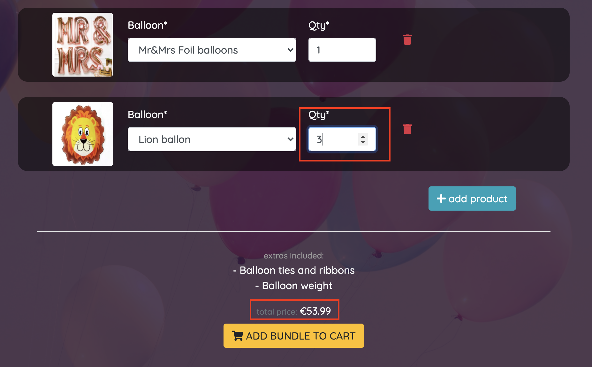
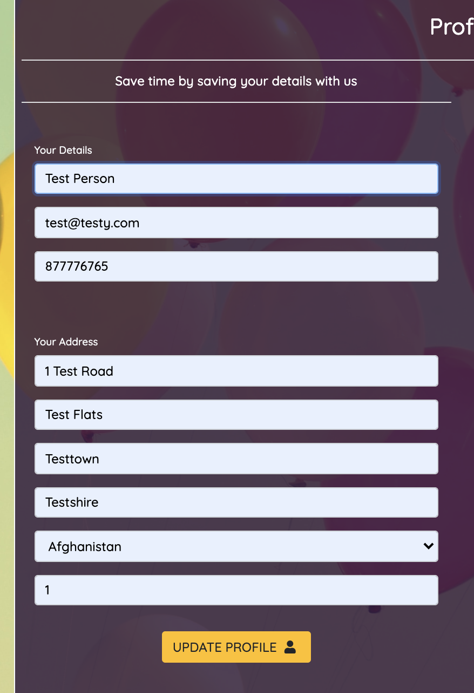

# Balloonatics 
[site available here](https://balloonatics.herokuapp.com/)
- The products and images used on this site are purely for demonstration. They have been acquired from various sources across the web including [Balloons For You](https://www.balloonsforyou.ie/), [Barrys Balloons](https://barryballoons.ie/), [Balloons Direct](https://balloonsdirect.ie/). If you are looking for Balloons in Dublin, then please visit these legends. 

Am I Responsive?

## UX
### Brief
Balloonatics is a real company founded by Niamh Traynor & Ruth Holbrook in Dublin, Ireland. As a duo they currently provide balloon bundling and corporate packages to their clients through word of mouth contacts and a small Facebook page. The company is currently only operating on a part time basis, but due to their success they are looking to expand and establish themselves as a brand online. They briefed for a new website with the following features:

- A store where we can sell individual balloons and accessories. 
- Some way we can offer promotions for upcoming seasons (Communions, Graduations, etc)
- An app where we can combine products into 'Bundles' and sell and a collection of balloons. Bundles would ideally be customisable by the user.
- An app that allows users to customise their own printed messages onto a balloon(s).
- A place where customers who are holding events can visualise events we have catered for and can drop us a query about the packages we can provide for them. 

### Project Requirements 
1. Django Full Stack Project: Build a Django project backend by a relational database to create a website that allows users to store and manipulate data records about a particular domain.
2. Multiple Apps: The project must be a brand new Django project, composed of multiple apps (an app for each potentially reusable component in your project).
3. Data Modeling: Put some effort into designing a relational database schema well-suited for your domain. Make sure to put some thought into the relationships between entities. Create at least 2 custom django models beyond the examples shown on the course
4. User Authentication: The project should include an authentication mechanism, allowing a user to register and log in, and there should be a good reason as to why the users would need to do so. e.g., a user would have to register to persist their shopping cart between sessions (otherwise it would be lost).
5. User Interaction: Include at least one form with validation that will allow users to create and edit models in the backend (in addition to the authentication mechanism).
6. Use of Stripe: At least one of your Django apps should contain some e-commerce functionality using Stripe. This may be a shopping cart checkout or single payments, or donations, etc. After paying successfully, the user would then gain access to additional functionality/content on the site. Note that for this project you should use Stripe's test functionality, rather than actual live payments.
7. Structure and Navigation: Incorporate a main navigation menu and structured layout (you might want to use Bootstrap to accomplish this).
8. Use of JavaScript: The frontend should contain some JavaScript logic you have written to enhance the user experience.
9. Documentation: Write a README.md file for your project that explains what the project does and the value that it provides to its users.
10. Version Control: Use Git & GitHub for version control.
11. Attribution: Maintain clear separation between code written by you and code from external sources (e.g. libraries or tutorials). Attribute any code from external sources to its source via comments above the code and (for larger dependencies) in the README.
12. Deployment: Deploy the final version of your code to a hosting platform such as Heroku.
13. Security: Make sure to not include any passwords or secret keys in the project repository. Make sure to turn off the Django DEBUG mode, which could expose secrets.

### User Stories
#### As the site owner...
##### US001 I want prospective users/providers to be greeted with an attractive Home Page, that has a simple, intuitive layout.
    - Given a user has navigated to the home page
    - When the page loads
    - Then they are met with an attractive and simple layout with relevant information

##### US002 I want prospective users/providers to see some examples of the products and services we offer in a visual format
    - Given a user has navigated to the home page
    - When the page loads
    - They have various examples of the products and services we offer in a digestable, appealing format

##### US003 I want users to be able to contact us when necessary, so we can provide them with the best service possible
    - Given a user has navigated to the site (not necessarily logged in)
    - When they search for contact details
    - Then they are easily available 

##### US004 I want to ensure users are given relevant and accurate information about site operational or user errors (e.g. Toasts/Messages/Error Pages)
    - Given an operation within the application is triggered
    - When that operation succeeds or fails
    - Then the user is given information pertaining to that operations' success/failure

#### US005 I want to be able to have a space where we can promote products in line woith upcoming seasons or other promotions
    - Given it is coming up to a particular season (Communion, Christmas, etc)
    - When I have decided on the promotion we would like to run
    - Then the the details of that promotion is prominent and visible to customers

##### US006 I want customers to be able to combine products into bundles in line with our brand usp
    - Given a user has navigated to the bundle page
    - When they select a category of bundle (birthday, wedding, etc)
    - Then they are presented with the relevant bundles to choose from

    - Given a user has selected a bundle
    - When the contents of that bundle is presented to them
    - Then they are able to edit the contents and quantaties of the components of that bundle

    - Given a user wants to edit the contents of a bundle
    - When the user clicks 'add new product'
    - Then they are given somewhere to choose the product

    - Given a user is editing their bundle and is adding a new component product to it 
    - When a user selects the product they want
    - They the total price of the bundle is adjusted and shown 

    - Given a user is editing their bundle and is changing the quantity of a component product
    - When a user selects the quantity they want
    - They the total price of the bundle is adjusted and shown 

    - Given a user wants to remove a product from their bundle
    - When a user clicks remove on the row
    - They the componenent product is removed from the bundle and the total price is updated

    - Given the user has finalised the composition of their bundle
    - When they add the bundle to the cart
    - Then that bundle is added to the cart and the grand total is updated

    - Given the user would like to edit the bundle again having added it to the cart
    - When they click on the bundle link in the cart
    - Then they are directed to the page where they can edit the bundle once more

    - Given the user would like to remove the bundle from the cart
    - When they click to remove the bundle
    - The bundle is removed and the saved customised bundle in the database is deleted

##### US007 I want customers to be able to customise printed messages onto balloons, so they can build their own customised orders
    - Given a user has navigated to the printing page
    - When they select a balloon product they wish to use to print on
    - Then they are given the option to compose the message and select a quantity

    - Given the user is adding a message to the balloon
    - When they have completed the message
    - Then they are given the appropriate feedback on the validity of the message

    - Given the user has compiled a valid message to print onto the balloon
    - When the user adjusted the quantity required
    - Then the the total price is shown to them

    - Given the user has compiled a valid message to print onto the balloon
    - When the user clicks add to cart 
    - Then the print order is added to the cart

    - Given the user has added a print order to the cart
    - When the user decides they want to edit the print order and click the link in the cart
    - Then they are redirected to the page where they can edit the print order details

    - Given the user wishes to delete the product from the cart
    - When they click delete link
    - Then the print order is removed from the cart and the custom entity is removed from the database

##### US008 I want customers to be able to see the types of event package we offer, so they have a good idea of our capabilities
    - Given a user has navigated to the events page
    - When the page loads
    - They can see examples the packages we offer

    - Given a user wishes to contact us regarding an event they are holding
    - When the user fills in the query form and submits 
    - Then the query is recieved and they are given the relevant feedback

##### US009 I want to be able to add new products to the site, so we can keep the product inventory fresh
    - Given we have a new product available for sale 
    - When I want to add that product 
    - Then I have a space where I can do that easily

##### US010 I want to be able to edit products we have on the site, so I can keep the product inventory up to date
    - Given there is a product who's information has changed
    - When I want to edit that product
    - Then I have a space where I can do that easily

##### US011 I want to be able to delete products we have on the site, so we do not have a lot of legacy products we do not want in the system
    - Given there is a product that is no longer for sale
    - When I want to delete that product
    - Then I have a space where I can do that easily

#### As a shopping customer...
##### US101 I want to be able to select a category of products, so that I can quickly locate the product I am interested in
    - Given I have navigated to the products pages 
    - When I click on a product category
    - Then I am presented with products only from that category

##### US102 I want to view a list of products, so that I can add the ones I wish to purchase to my shopping bag
    - Given I have navigated to the products pages 
    - When I click on an item to add to my shopping bag
    - Then that item is added to my shopping bag and the bag total is adjusted accordingly

##### US103 I want to sort a list of products by different properties (price, name, etc), so that I can quickly identify ones I may wish to purchase
    - Given I have navigated to the products pages 
    - When I want to see products listed by a certain property
    - Then the items are displayed according to my selection

##### US104 I want to view more details of a particular product, so that I can gather more information and decide whether I wish to purchase it
    - Given I have navigated to the products pages 
    - When I click on an item
    - Then I am redirected to a page with more details regarding that item.

##### US105 I want to be able to view the total in my shopping bag at any time, so that I can keep track of the total of the items I have added
    - Given I have added items to the shopping cart
    - Whenever I am present on the site
    - Then I can view the total in my shopping cart

##### US106 I want to add products to my shopping cart so that I can purchase them
    - Given I have decided that I wish to purchase a product, and selected the appropriate quantity
    - When click add to bag
    - Then product is added to my shoppping cart

##### US107 I want to be able to edit the items in my shopping bag
    - Given I have items in my shopping bag
    - When I decide I want to remove one and click delete
    - Then product is removed from my shopping bag and the bag total is updated

    - Given I have items in my shopping bag
    - When I decide I want to edit the quantity of one and adjust the quantity
    - Then the quantity is amended and the bag total is updated

##### US108 I wish to be able to register for an account
    - Given I have decided I would like an account
    - When I navigate to the registration form and submit my details
    - Then an account is created for me

##### US109 I wish to be able complete my purchase of items in my shopping bag
    - Given I have selected all the items I wish to purchase 
    - When I submit my details correctly
    - Then I am given confirmation the purchase has completed, along with an order number

    - Given I have selected all the items I wish to purchase 
    - When I submit my details incorrectly
    - Then I am given a warning and instructions as to what went wrong

#### As an existing customer...
##### US201 I want to be able to login to my profile so that I can perform actions agaisnt my profile and purchase more products
    - Given I have navigated to the site 
    - When I want to log in
    - Then I can easily do so

    - Given I have navigated to the login page
    - When I fill in the form correctly
    - Then I am redirected to my profile

    - Given I have navigated to the login page
    - When I fill in the form incorrectly
    - Then I can see what I have done wrong

    - Given I have logged into my account 
    - When I view my profile page
    - Then I am able to edit and save my details

    - Given I have logged into my account 
    - When I view my profile page
    - Then I am able to view my order history and their contents

##### US202 I want to be able to recover my password, so that I can always access my account even if I forget it
    - Given I am trying to log in 
    - When I have forgotten my password
    - Then I click a link to set a new one

##### US203 I want to be able to log out of my account
    - Given I am logged in to my account
    - When I wish to log out
    - Then I can click a link to log out, and I am logged out

### Wireframes
Wireframes were designed using JustInMind and images of the slides can be viewed in the following table:

|      Desktop    |      Mobile     | 
|       :----:    |      :----:     | 
|[Home]('readme-files/wireframes/Desktop/Home.JPG')|[Home]('readme-files/wireframes/Mobile/Home.JPG')|
|[Shop]('readme-files/wireframes/Desktop/Shop.JPG')|[Shop]('readme-files/wireframes/Mobile/Shop.JPG')|
|[Bundles]('readme-files/wireframes/Desktop/Bundle.JPG')|[Bundles]('readme-files/wireframes/Mobile/Bundle.JPG')|
|[Printing]('readme-files/wireframes/Desktop/Printing.JPG')|[Printing]('readme-files/wireframes/Mobile/Printing.JPG')|
|[Event]('readme-files/wireframes/Desktop/Event.JPG')|

---

## Features 

### General site features

**Header** 
- Company Logo (links to home page)
- Search bar for search products by product name
- My Account controls (login/register/product management)
- Link to cart displaying cart total
- Navbar links to other site features
- Promotional banner
*The header is fixed at the top of the page. A condensed version is only visible on mobile.

**Footer**
- Links to social (just placeholders at the moment)
- Navigation menu to site features
- Contact details 
- Company Address
*The footer is available at the bottom of the page

**Home**
- Short "About Us" paragraph bubble
- Links to Online Shop (listed by Category and then Sub Category)
- Build-a-Bundle row with information about our bundle service. Includes slideshow of Bundle ideas.
- Balloon Printing row with information about our printing service. Includes slideshow of Printing ideas.
- Your Event row with information pertaining to the events we offer packages for. Includes slideshow of our events.

**Cart**
- See the items you have added to the cart 
- Update the qtys (only available for shopped individual products, not bundles/prints. Links to edit pages for those)
- Remove item from cart
- See order totals
- Link to checkout

**Checkout** 
- Order form for customer details and address
- Order Summary showing items in the order and totals
- Stripe payment section with input for card details

**Checkout Success**
- Details about the order including order id for reference 

**Product Mangagement**
- Super users can add, edit and delete products in this space

**User Profile**
- Users can create a profile for their account where they can save and update their information
- Users can also see their order history here which links to the checkout success page for each order

### Balloonatics specific features

**Build-a-Bundle**
- Toggle to show the slideshow for interested parties
- Bundle Category Selector form. Shows only the revelant bundles for the customer's occasion.
- Select your bundle template section. Select the bundle you want. 
- Customise the items in your bundle formset. Edit the components of the bundle, add new ones, take one away, change the qty, it's up to you.
- See the total cost of the bundle, updates with every changed selection

**Balloon Printing**
- Toggle to show the slideshow for interested parties
- Select the balloon you want to print your message on
- Custom Print Order form. Add your message and specify the quantity of balloons you would like. 
- See the total cost of the print order, updates on product selection and qty change

**Your Event**
- Sample packages by price
- Query form 

### Feature Roadmap
- Make the general site features completely agnostic, so that the non specific features of the site can be configured for other product domains easily. This would require a redesign to some extent with removal of all depenedency on Balloonatics specific content/models/views within the general site features (Home/Cart/Checkout, etc). The vision for this project would be to be become a customisable white label store which could theoretically sell any product. 

**Products**
- Implement features and sorting around product ratings
- Introduce "Special Offers" space, where products with discounts can be highlighted
- Sort products by a greater variety of parameters on the Product model (e.g. Color, Size, Material)

**Balloon Printing** 
- Offer option for users to upload images that can be printed onto balloons in addition to text.
- Offer the option for users to specify the style/design of the text printed onto the balloons. 

**Your Event**
- Give more detail about packages available and extend the content in this space with more images
- Extend the form to include event date 

**Cart**
- Add more detailed and intuitive delivery costing, rather than a blanket surcharge
- Inform the customer whether the item needs to be shipped inflated or deflated

### Models
* Bundles (3 [models](https://github.com/Cldwlkn13/balloonatics/blob/master/bundles/models.py))
    - BundleCategory
    - Bundle
    - BundleItem

* Checkout (3 [models](https://github.com/Cldwlkn13/balloonatics/blob/master/checkout/models.py))
    - Address 
    - Order
    - OrderItem

* Events (2 [models](https://github.com/Cldwlkn13/balloonatics/blob/master/events/models.py))
    - Event
    - EventType

* Printing (1 [model](https://github.com/Cldwlkn13/balloonatics/blob/master/printing/models.py))
    - CustomPrintOrder

* Products (6 [models](https://github.com/Cldwlkn13/balloonatics/blob/master/products/models.py))
    - Category
    - Material
    - Color
    - Size
    - SubCategory
    - Product

* Profiles (1 [model](https://github.com/Cldwlkn13/balloonatics/blob/master/profiles/models.py))
    - UserProfile

## Technologies

#### Development:
- [GitHub](https://github.com/) - site host.
- [Gitpod](https://gitpod.io/) - dev IDE.

#### Key content, styling & logic:
- [HTML5](https://en.wikipedia.org/wiki/HTML5) - site content
- [CSS3](https://en.wikipedia.org/wiki/Cascading_Style_Sheets) - site styling
- [Bootstrap](https://getbootstrap.com/) - project layout & additional styling
- [Javascript](https://en.wikipedia.org/wiki/JavaScript) - functional logic & gameplay

#### Backend:
- [Python](https://www.python.org/) - Server Language
- [Django](https://www.djangoproject.com/) - Python MVC framework

#### Database:
- [Sqlite3](https://en.wikipedia.org/wiki/SQLite) - Local Database implementation
- [Postgres](https://en.wikipedia.org/wiki/PostgreSQL) - Production Database store

#### Deployment: 
- [Heroku](https://www.heroku.com/) - Cloud Container Application Platform 
- [AWS S3](https://aws.amazon.com/aws/s3/) - Static/Media file storages

#### Supplementary technologies
- [JustInMind](https://www.justinmind.com/) - wireframes and site prototype
- [FontAwesome](https://fontawesome.com/) - inline icons
- [GoogleFonts](https://fonts.google.com/) - font faces
- [Gmail](https://gmail.com/) - SMTP Email Server

## Testing

#### Browser Compatibility

 - **Google Chrome** No issues identified;
 
 - **Microsoft Edge** No issues identified;

 - **Mozilla Firefox** No issues identified;
    
 - **Opera** No issues identified;

 - **Microsoft Internet Explorer** tbc

#### Responsiveness Quality Testing
Testing conducted on [Responsive Design Checker](https://www.browserstack.com/responsive)

-   [Mobile](readme-files/testing/mobile.jpg) - 0 issues
-   [Tablet](readme-files/testing/tablet.jpg) - 0 issues
-   [Desktop](readme-files/testing/desktop.jpg) - 0 issues

#### User Story Testing  

#### As the site owner...
##### <ins>US001 I want prospective users/providers to be greeted with an attractive Home Page, that has a simple, intuitive layout. &check;</ins>
    - Given a user has navigated to the home page
    - When the page loads
    - Then they are met with an attractive and simple layout with relevant information
**Features laid out in a nice grid, clearly labelled. Keep text to a minimum to avoid information overload.**
 
##### <ins>US002 I want prospective users/providers to see some examples of the products and services we offer in a visual format &check;</ins>
    - Given a user has navigated to the home page
    - When the page loads
    - They have various examples of the products and services we offer in a digestable, appealing format
**Interactive slideshows of related products for the site features give to user a compact, accessible way to view content**

##### <ins>US003 I want users to be able to contact us when necessary, so we can provide them with the best service possible &check;</ins>
    - Given a user has navigated to the site (not necessarily logged in)
    - When they search for contact details
    - Then they are easily available
**Contact details present in the Footer of each page** 

##### <ins>US004 I want to ensure users are given relevant and accurate information about site operational or user errors (e.g. Toasts/Messages/Error Pages) &check;</ins>
    - Given an operation within the application is triggered
    - When that operation succeeds or fails
    - Then the user is given information pertaining to that operations' success/failure
**Toasts pop up to display messages to the user across the site.**

**Custom error pages display human readable exception content to the user when something serious goes awry**

##### <ins>US005 I want to be able to have a space where we can promote products in line woith upcoming seasons or other promotions &check;</ins>
    - Given it is coming up to a particular season (Communion, Christmas, etc)
    - When I have decided on the promotion we would like to run
    - Then the the details of that promotion is prominent and visible to customers
**Promotional banner sits just underneath the header content on all > large screens**

##### <ins>US006 I want customers to be able to combine products into bundles in line with our brand usp &check;</ins>
    - Given a user has navigated to the bundle page
    - When they select a category of bundle (birthday, wedding, etc)
    - Then they are presented with the relevant bundles to choose from
**Bundles from the correct category show up when selected**

    - Given a user has selected a bundle
    - When the contents of that bundle is presented to them
    - Then they are able to edit the contents and quantaties of the components of that bundle
**When a bundle is selected the user is redirected to bundle/withitems and its components are displayed**

    - Given a user wants to edit the contents of a bundle
    - When the user clicks 'add new product'
    - Then they are given somewhere to choose the product
**When the user selects 'add new product' then a row row is added to the bottom of the formset with default selections**

    - Given a user is editing their bundle and is adding a new component product to it 
    - When a user selects the product they want
    - They the total price of the bundle is adjusted and shown
**When the user is adding a component product and they change the 'Balloon' input selection, the price is updated to reflect**

    - Given a user is editing their bundle and is changing the quantity of a component product
    - When a user selects the quantity they want
    - They the total price of the bundle is adjusted and shown
**When the user is editing the quantity value, the price is updated to reflect**

    - Given a user wants to remove a product from their bundle
    - When a user clicks remove on the row
    - They the componenent product is removed from the bundle and the total price is updated
**When the user clicks the little red trash can to remove the component, the row is hidden and that component is disabled. The price is also updated once more**

    - Given the user has finalised the composition of their bundle
    - When they add the bundle to the cart
    - Then that bundle is added to the cart and the grand total is updated
**When the user clicks to add the finalised bundle to the cart then the bundle appears in the cart and the grand total is updated**

    - Given the user would like to edit the bundle again having added it to the cart
    - When they click on the bundle link in the cart
    - Then they are directed to the page where they can edit the bundle once more
**From either the cart page or the toast bag preview, the user can click the name of the bundle and it will link them back to the bundle/withitems where they can make any amendments they desire**

    - Given the user would like to remove the bundle from the cart
    - When they click to remove the bundle
    - The bundle is removed and the saved customised bundle in the database is deleted
**When the user clicks on the little red trash can within the cart, the item is removed from the cart, deleted from the custom bundles in the db and the cart total is updated**

##### <ins>US007 I want customers to be able to customise printed messages onto balloons, so they can build their own customised orders &check;</ins>
    - Given a user has navigated to the printing page
    - When they select a balloon product they wish to use to print on
    - Then they are given the option to compose the message and select a quantity
**When the user selects a printable balloon product the form appears to customise the message and update the qty**

    - Given the user is adding a message to the balloon
    - When they have completed the message
    - Then they are given the appropriate feedback on the validity of the message
**The message the user is adding is validated on the client side and appropriate information is displayed to them**

    - Given the user has compiled a valid message to print onto the balloon
    - When the user adjusted the quantity required
    - Then the the total price is shown to them
**Once the message is validated, and the user updates the qty, then the total price for the print order is updated to reflect**

    - Given the user has compiled a valid message to print onto the balloon
    - When the user clicks add to cart 
    - Then the print order is added to the cart
**Once the message is validated, then the print order is added to the cart**

    - Given the user has added a print order to the cart
    - When the user decides they want to edit the print order and click the link in the cart
    - Then they are redirected to the page where they can edit the print order details
**From any cart view, the user can click on the print order name and be directed back to the print order page to make any amendments they desire**

    - Given the user wishes to delete the product from the cart
    - When they click delete link
    - Then the print order is removed from the cart and the custom entity is removed from the database
**When the user clicks on the little red trash can within the cart, the item is removed from the cart, deleted from the custom print orders in the db and the cart total is updated**
 
##### <ins>US008 I want customers to be able to see the types of event package we offer, so they have a good idea of our capabilities &check;</ins>
    - Given a user has navigated to the events page
    - When the page loads
    - They can see examples the packages we offer
**At the top of the Your Event page the user can see three types of example packages and their costs**

    - Given a user wishes to contact us regarding an event they are holding
    - When the user fills in the query form and submits u
    - Then the query is recieved and they are given the relevant feedback
**When the user submits the form correctly, they are thanked and the query appears in the database to be actioned**

##### <ins>US009 I want to be able to add new products to the site, so we can keep the product inventory fresh &check;</ins>
    - Given we have a new product available for sale 
    - When I want to add that product 
    - Then I have a space where I can do that easily
**When logged in as a superuser, the user can navigate to product management and click to add a product. They are then presented with a form to complete to add the required details**

**If the form is completed adequately then a new product entry is added to the Products table of the database**

##### <ins>US010 I want to be able to edit products we have on the site, so I can keep the product inventory up to date &check;</ins>
    - Given there is a product who's information has changed
    - When I want to edit that product
    - Then I have a space where I can do that easily
**At the same url (products/loadproducts), the user can click to edit an existing product from the list of all products. Selecting a product loads the form**
**If the form is completed adequately then the product entry is updated on the Products table of the database**

##### <ins>US011 I want to be able to delete products we have on the site, so we do not have a lot of legacy products we do not want in the system &check;</ins>
    - Given there is a product that is no longer for sale
    - When I want to delete that product
    - Then I have a space where I can do that easily
**At the same url (products/loadproducts), when the user selects a product to edit, they are given an option to delete the product when the form loads**
**The product entry is deleted on the Products table of the database**

---------------------------------------------------------------------------------------------------------------
#### As a shopping customer...
##### <ins>US101 I want to be able to select a category of products, so that I can quickly locate the product I am interested in &check;</ins>
    - Given I have navigated to the products pages 
    - When I click on a product category
    - Then I am presented with products only from that category
**Selecting a product category will load all the available sub categories with products. No sub categories should be shown to the user that do no have products with that associated Category key**

##### <ins>US102 I want to view a list of products, so that I can add the ones I wish to purchase to my shopping bag &check;</ins>
    - Given I have navigated to the products pages 
    - When I click on an item to add to my shopping bag
    - Then that item is added to my shopping bag and the bag total is adjusted accordingly
**Users can select a group of products from the sub categories, or they can filter by name in the header search bar**
**Users can hit the 'add' btn to add the product to their bag. The cart total is updated accordingly**

##### <ins>US103 I want to sort a list of products by different properties (price, name, etc), so that I can quickly identify ones I may wish to purchase &check;</ins>
    - Given I have navigated to the products pages 
    - When I want to see products listed by a certain property
    - Then the items are displayed according to my selection
**On the products page, users can sort their products by both name and price for convinience**

##### <ins>US104 I want to view more details of a particular product, so that I can gather more information and decide whether I wish to purchase it &check;</ins>
    - Given I have navigated to the products pages 
    - When I click on an item
    - Then I am redirected to a page with more details regarding that item.
**When a user clicks on a product image, they a redirected to the url for that product where they can view more information**

##### <ins>US105 I want to be able to view the total in my shopping bag at any time, so that I can keep track of the total of the items I have added &check;</ins>
    - Given I have added items to the shopping cart
    - Whenever I am present on the site
    - Then I can view the total in my shopping cart
**Cart links are available on all screens in the top right of the header bar. A total in the bag is displayed for convinience and clicking the icon links to the cart page**

##### <ins>US106 I want to add products to my shopping cart so that I can purchase them &check;</ins>
    - Given I have decided that I wish to purchase a product, and selected the appropriate quantity
    - When click add to bag
    - Then product is added to my shoppping cart
**Users can add products to their cart from the product-card previews for convinience, or from the product detail url for each product**

##### <ins>US107 I want to be able to edit the items in my shopping bag &check;</ins>
    - Given I have items in my shopping bag
    - When I decide I want to remove one and click delete
    - Then product is removed from my shopping bag and the bag total is updated
**Users update qtys or remove an item from their bag by clicking the little red trash can on any cart view**

    - Given I have items in my shopping bag
    - When I decide I want to edit the quantity of one and adjust the quantity
    - Then the quantity is amended and the bag total is updated
**With the cart page, users can edit quantities on a product in their bag and the totals will automatically update**

##### <ins>US108 I wish to be able to register for an account &check;</ins>
    - Given I have decided I would like an account
    - When I navigate to the registration form and submit my details
    - Then an account is created for me
**Users can register for a new account in the register form which can be linked to from any page in the header 'Login/Register' link**
**A new row for the user is added to the Users table in the database**

##### <ins>US109 I wish to be able complete my purchase of items in my shopping bag &check;</ins>
    - Given I have selected all the items I wish to purchase 
    - When I submit my details correctly
    - Then I am given confirmation the purchase has completed, along with an order number
**Users can fill in the details, address & payment forms on the checkout page.**
**If completed correctly then the payment intent is forwarded to stripe.**
**If payment is successful, then the order is processed in the server and recorded in the Order table in the database**

    - Given I have selected all the items I wish to purchase 
    - When I submit my details incorrectly
    - Then I am given a warning and instructions as to what went wrong
**The forms listed above are all validated defensively and an order will not process with insuffcient or inadequate data**

#### As an existing customer...
##### <ins>US201 I want to be able to login to my profile so that I can perform actions agaisnt my profile and purchase more products &check;</ins>
    - Given I have navigated to the site 
    - When I want to log in
    - Then I can easily do so
**Users can login via the login form, which is linked to from any page in the 'Login/Register' menu in the header**

    - Given I have navigated to the login page
    - When I fill in the form incorrectly
    - Then I can see what I have done wrong
**Users who do not fill in their details correctly are not able to login**

    - Given I have logged into my account 
    - When I view my profile page
    - Then I am able to edit and save my details
**Once a user has registered (and logged in) they will be able to navigate to their profile page from the Account Menu**

    - Given I have logged into my account 
    - When I view my profile page
    - Then I am able to view my order history and their contents
**Users can view their order history on their profile page**

##### <ins>US202 I want to be able to recover my password, so that I can always access my account even if I forget it &check;</ins>
    - Given I am trying to log in 
    - When I have forgotten my password
    - Then I click a link to set a new one
**On the login page, users can hit the 'forgot password' link whereUSD they are invited to add their registered email address to a form and will be sent a link**

##### <ins>US203 I want to be able to log out of my account &check;</ins>
    - Given I am logged in to my account
    - When I wish to log out
    - Then I can click a link to log out, and I am logged out
**Once logged in, users can log out from any page in the 'My Account' menu in the header bar**

**Bugs**
- Slideshows can occasionally be a little sticky in transition
- The qty widget does not center very well in some scenarios 

## Deployment

#### Setting up Stripe
- Sign Up for Stripe [here](https://dashboard.stripe.com/register)
- Once registered navigate to the [developer api keys](https://dashboard.stripe.com/test/apikeys) on the dashboard where you can find your api keys
- In the [webhooks](https://dashboard.stripe.com/test/webhooks) section click 'add new endpoint'. Configure the endpoint to point at your app append the root url with '/checkout/wh/'. Here you can copy the webhook secret that the app needs to verify it with stripe for webhooks. You can also test the connection by sending test webhooks to the endpoint. 
- Entering the card number **4242424242424242** exp **04/24** cvc **424** zip **42424** will process a test payment to the server. 

#### To Deploy to Heroku
- Ensure the requirements.txt file is up to date by running in your IDE: **pip3 freeze -- local > requirements.txt**
- Create a ProcFile and add **web: gunicorn balloonatics.wsgi:application**
- If you do not have a heroku account, create one [here]("https://www.heroku.com/")
- https://dashboard.heroku.com/apps/<your_app> provides an overview of the deployment.
- Connect the app to your github repository on the deploy tab. 
- In the settings tab, navigate to settings, then reveal config vars.
- Add the custom environment vairables as prescribed in your local settings.py file. (see below)
- Ensure the master branch is up to date. 
- Navigate to the dashboard, then deploy tab. 
- Hit deploy branch. 

#### Required Environment Variables
- AWS_ACCESS_KEY_ID (your access key from your account in AWS IAM)
- AWS_SECRET_ACCESS_KEY (your secret access key from your account in AWS IAM)
- DATABASE_URL (the postgres database url. This should automatically populate when you create your heroku app)
- EMAIL_HOST_PASS (gmail secret app key, an excellent guide for setting up gmail with django [here](https://data-flair.training/blogs/django-send-email/))
- EMAIL_HOST_USER (your gmail account address)
- SECRET_KEY (django secret key, can generated [here](https://miniwebtool.com/django-secret-key-generator/))
- STRIPE_PUBLIC_KEY (stripe public key, see above)
- STRIPE_SECRET_KEY (stripe secret key, see above)
- STRIPE_WH_KEY (stripe wh secret, see above)
- USE_AWS (if you have your AWS bucket set up then you can set this to True)

#### Setting up the AWS S3 Bucket
- If you do not have an AWS account then [this link](https://aws.amazon.com/premiumsupport/knowledge-center/create-and-activate-aws-account/) provides a quick guide to setting one up. 
- Follow [this link](https://docs.aws.amazon.com/quickstarts/latest/s3backup/step-1-create-bucket.html) to set up an S3 bucket, as image uploads will be directed here. 
- Once your bucket is created, you need to add the following json to the CORS section of the permissions section of your bucket. 
;;;
[
    {
        "AllowedHeaders": [
            "*"
        ],
        "AllowedMethods": [
            "GET",
            "HEAD",
            "POST",
            "PUT"
        ],
        "AllowedOrigins": [
            "*"
        ],
        "ExposeHeaders": []
    }
]
;;;
- Also in the permissions section ensure your bucket is publically accessible by turning off **Block public access (bucket settings)**

#### To clone from Github

1. In the Github repository click the green **Code** button.
2. Select clone protocol of your choice (SSL/HTTP/CLI)
3. Go to your IDE.
3. Open **Git Bash**.
4. Change the current working directory to the location where you want the cloned directory to be made.
5. Type **git clone**, and then paste the URL copied from GitHub.
6. Press **enter** and the local clone will be created.

*for more information on cloning in git hub, please see [github cloning documentation](https://docs.github.com/en/free-pro-team@latest/github/creating-cloning-and-archiving-repositories/cloning-a-repository)

#### To run locally
- Once the project has been cloned, open the project in your IDE. 
- Install requirements by running **pip3 install -r requirements.txt**
- To run the server enter **python3 manage.py runserver**

## Credits
- Much of the basis of the functionality for this project was learned from the awesome Full Stack Frameworks With Django [Boutique Ado](https://github.com/ckz8780/boutique_ado_v1) project walkthrough.
- The products and images used on this site are purely for demonstration. They have been acquired from various sources across the web including [Balloons For You](https://www.balloonsforyou.ie/), [Barrys Balloons](https://barryballoons.ie/), [Balloons Direct](https://balloonsdirect.ie/). If you are looking for Balloons in Dublin, then please visit these legends. 
- [W3 Schools](https://www.w3schools.com/) for various ideas, snippets and solutions. 
- Slideshow inspirations and code from [here](https://www.w3schools.com/howto/howto_js_slideshow.asp)
- Inspiration for the footer design from [here](https://bbbootstrap.com/snippets/simple-footer-social-media-icons-37929510)
- ScrollTo instruction from [here](https://stackoverflow.com/questions/6677035/jquery-scroll-to-element)

## Acknowledgments
[Precious Ijege](https://www.linkedin.com/in/precious-ijege-908a00168/?originalSubdomain=ng) for all his support and guidance.

I would like to thank Susan for their feedback and support through this process!

## Disclaimer
This project was completed as part of the Full Stack Developer Milestone 4 project. If you have any questions or issues surrounding copyright please contact me at gavin_rudge@hotmail.co.uk
